# Data Model: Behavioral Cross-List Linking System

## Enhanced Item Entity

### Core Item Structure (Existing)
```typescript
interface Item {
  id: string              // UUID primary key
  list_id: string         // Foreign key to lists table
  content: string         // Item text content (max 500 chars)
  is_completed: boolean   // Completion status
  completed_at?: string   // ISO timestamp when completed
  target_date?: string    // ISO date for countdown lists
  position: number        // Sort order within list
  created_at: string      // ISO timestamp
  updated_at: string      // ISO timestamp
  linked_items: any       // Enhanced structure (see below)
}
```

### Enhanced Linked Items Structure
```typescript
interface LinkedItemsData {
  children?: string[]      // Array of child item UUIDs (this item controls them)
  parents?: string[]       // Array of parent item UUIDs (they control this item)
  bidirectional?: string[] // Legacy informational links (no behavioral control)
}

// Examples:
// Parent item: { "children": ["child-1", "child-2"] }
// Child item: { "parents": ["parent-1", "parent-2"] }
// Mixed item: { "children": ["child-1"], "parents": ["parent-1"] }
// Legacy link: { "bidirectional": ["other-item"] }
```

## Behavioral Rules

### Parent-Child Relationship Constraints
- **1-to-Many**: One parent can have multiple children
- **Many-to-1**: One child can have multiple parents
- **No Cycles**: A→B prevents B→A (direct or indirect)
- **No Self-Links**: Item cannot be parent of itself
- **Referential Integrity**: Deleted items removed from all link arrays

### Status Propagation Logic
```typescript
interface StatusPropagationRules {
  // TRIGGERED: When parent moves from completed → todo
  parentToTodo: {
    trigger: "parent.is_completed: true → false"
    action: "child.is_completed: true → false (if child.is_completed === true)"
    condition: "only affects completed children"
  }

  // NO ACTION: When parent moves from todo → completed
  parentToCompleted: {
    trigger: "parent.is_completed: false → true"
    action: "none"
    reason: "Children maintain independent completion"
  }

  // NO ACTION: When child completion changes
  childStatusChange: {
    trigger: "child.is_completed: any → any"
    action: "none"
    reason: "Child changes don't affect parents"
  }
}
```

## Link Creation Entity

### Link Creation Session
```typescript
interface LinkCreationSession {
  parentItem: Item         // Selected parent item
  targetItems: Item[]      // Selected children to link
  validationResult: {
    canLink: boolean       // All targets can be linked
    conflicts: string[]    // Items that would create cycles
    warnings: string[]     // Informational messages
  }
}
```

### Validation Rules
```typescript
interface LinkValidationRules {
  preventCycles: boolean     // Block A→B when B already reaches A
  preventSelfLink: boolean   // Block A→A relationships
  allowMultipleParents: boolean  // Child can have multiple parents
  maxChildrenPerParent: number   // Unlimited (-1)
  maxParentsPerChild: number     // Unlimited (-1)
}
```

## Visual Indicator Entity

### Link Display Metadata
```typescript
interface LinkIndicatorData {
  type: 'parent' | 'child' | 'mixed' | 'bidirectional'
  parentCount: number      // Number of parents controlling this item
  childCount: number       // Number of children this item controls
  bidirectionalCount: number // Number of legacy links
  displayText: string      // E.g., "⬇️3", "⬆️2", "⬇️2⬆️1"
  ariaLabel: string        // E.g., "3 children", "2 parents", "2 children, 1 parent"
}

// Display Logic:
// Parent only: "🔗⬇️3"
// Child only: "🔗⬆️2"
// Mixed: "🔗⬇️2⬆️1"
// Legacy: "🔗2"
```

## Database Schema Changes

### Migration for Enhanced linked_items
```sql
-- No schema change needed - jsonb field accommodates new structure
-- Existing linked_items jsonb field will store enhanced structure
-- Current data: ["item-1", "item-2"] (array of strings)
-- New data: {"children": ["item-1"], "parents": ["item-2"]}

-- Add validation constraint for new structure
ALTER TABLE items
ADD CONSTRAINT linked_items_valid_structure
CHECK (
  linked_items IS NULL OR
  jsonb_typeof(linked_items) = 'object' OR
  jsonb_typeof(linked_items) = 'array'  -- Support legacy format during transition
);

-- Enhanced helper functions
CREATE OR REPLACE FUNCTION get_child_items(parent_item_id UUID)
RETURNS TABLE(
  id UUID,
  list_id UUID,
  content TEXT,
  is_completed BOOLEAN,
  list_title TEXT,
  list_type list_type
) AS $$
BEGIN
  RETURN QUERY
  SELECT
    i.id,
    i.list_id,
    i.content,
    i.is_completed,
    l.title as list_title,
    l.type as list_type
  FROM items i
  JOIN lists l ON i.list_id = l.id
  CROSS JOIN LATERAL jsonb_array_elements_text(
    COALESCE(
      (SELECT linked_items->'children' FROM items WHERE id = parent_item_id),
      '[]'::jsonb
    )
  ) AS child_id
  WHERE i.id = child_id::uuid
  ORDER BY l.title, i.position;
END;
$$ LANGUAGE plpgsql;

CREATE OR REPLACE FUNCTION get_parent_items(child_item_id UUID)
RETURNS TABLE(
  id UUID,
  list_id UUID,
  content TEXT,
  is_completed BOOLEAN,
  list_title TEXT,
  list_type list_type
) AS $$
BEGIN
  RETURN QUERY
  SELECT
    i.id,
    i.list_id,
    i.content,
    i.is_completed,
    l.title as list_title,
    l.type as list_type
  FROM items i
  JOIN lists l ON i.list_id = l.id
  CROSS JOIN LATERAL jsonb_array_elements_text(
    COALESCE(
      (SELECT linked_items->'parents' FROM items WHERE id = child_item_id),
      '[]'::jsonb
    )
  ) AS parent_id
  WHERE i.id = parent_id::uuid
  ORDER BY l.title, i.position;
END;
$$ LANGUAGE plpgsql;
```

## State Transitions

### Item Status Lifecycle with Parent-Child Behavior

```mermaid
stateDiagram-v2
    [*] --> Todo : Create item
    Todo --> Completed : User marks complete
    Completed --> Todo : User marks incomplete

    state "Parent Status Change" as ParentChange {
        [*] --> CheckChildren : Parent: Completed → Todo
        CheckChildren --> PropagateToTodo : Has completed children
        CheckChildren --> NoAction : All children already todo
        PropagateToTodo --> [*] : Children: Completed → Todo
        NoAction --> [*]
    }

    state "Child Status Change" as ChildChange {
        [*] --> NoParentAction : Child status changes
        NoParentAction --> [*] : Parents unaffected
    }

    Completed --> ParentChange : If has children
    Todo --> ChildChange : If has parents
```


## Data Consistency Rules

### Referential Integrity
1. **Bidirectional Consistency**: If A.children contains B, then B.parents must contain A
2. **Cleanup on Delete**: When item deleted, remove its ID from all other items' link arrays
3. **Cycle Prevention**: Before adding parent→child link, verify child cannot reach parent
4. **Self-Link Prevention**: Item ID cannot appear in its own children array

### Migration Strategy
1. **Preserve Existing**: Convert current `linked_items: ["id1", "id2"]` to `linked_items: {"bidirectional": ["id1", "id2"]}`
2. **Gradual Transition**: Support both formats during migration period
3. **Validation**: Ensure all references point to existing items
4. **Cleanup**: Remove orphaned references during migration

---

## Validation Summary

✅ **Enhanced data model maintains backward compatibility**
✅ **Parent-child relationships clearly defined**
✅ **Status propagation rules unambiguous**
✅ **Visual indicators support all relationship types**
✅ **Database changes minimal and safe**
✅ **Referential integrity preserved**

**Ready for Contract Generation**